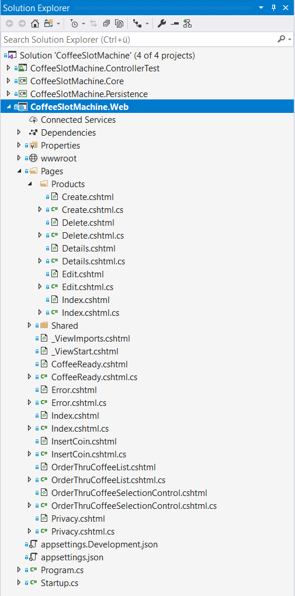

# LiveCoding Razor Pages


## Solution Explorer



## Layout anpassen => Link hinzufügen

```html
<li class="nav-item">
    <a class="nav-link text-dark" asp-area="" asp-page="/Products/Index">Products</a>
</li>
```

## Übersicht über alle Produkte (Index)

## PageModel

```cs
public class IndexModel : PageModel
{
    private readonly IUnitOfWork _unitOfWork;

    public IndexModel(IUnitOfWork unitOfWork)
    {
        _unitOfWork = unitOfWork;
    }

    public Product[] Products { get; set; }

    public string ProductFilter { get; set; }

    public async Task OnGet(string searchString)
    {
        if(!string.IsNullOrEmpty(searchString))
        {
            Products = await _unitOfWork.Products.GetByNameAsync(searchString);
            ProductFilter = searchString;
        } else
        {
            Products = await _unitOfWork.Products.GetAllAsync();
        }
    }
}
```

## View

```html
@page
@model CoffeeSlotMachine.Web.Pages.Products.IndexModel
@{
  ViewData["Title"] = "All Products";
}

<p>
  <a asp-page="./Create">Create New</a>
</p>

<form asp-page="./Index" method="get">
  <div class="form-actions no-color">
    <p>
      Find by name:
      <input type="text" name="SearchString" value="@Model.ProductFilter" />
      <input type="submit" value="Search" class="btn btn-default" /> |
      <a asp-page="./Index">Back to full List</a>
    </p>
  </div>
</form>

<table class="table">

  <thead>
    <tr>
      <th>
        @Html.DisplayNameFor(model => model.Products.FirstOrDefault().Name)
      </th>
      <th>
        @Html.DisplayNameFor(model => model.Products.FirstOrDefault().PriceInCents)
      </th> 
      <th>
        @Html.DisplayNameFor(model => model.Products.FirstOrDefault().RowVersion)
      </th>
      <th>

      </th>
    </tr>
  </thead>

  <tbody>
    @foreach (var product in Model.Products)
    {
      <tr>
        <td>
          @Html.DisplayFor(_ => product.Name)
        </td>
        <td>
          @Html.DisplayFor(_ => product.PriceInCents)
        </td>
        <td>
          @Html.DisplayFor(_ => product.RowVersion)
        </td>
        <td>
          <a asp-page="./Edit" asp-route-id="@product.Id">Edit</a> |
          <a asp-page="./Details" asp-route-id="@product.Id">Details</a> |
          <a asp-page="./Delete" asp-route-id="@product.Id">Delete</a> 
        </td>
      </tr>
    }
  </tbody>

</table>


```


## Details zu einem Produkt (Details)

## PageModel

```cs
public class DetailsModel : PageModel
{
  private readonly IUnitOfWork _unitOfWork;

  public DetailsModel(IUnitOfWork unitOfWork)
  {
    _unitOfWork = unitOfWork;
  }

  public Product Product { get; set; }

  public async Task<IActionResult> OnGet(int? id)
  {
    if(id==null)
    {
      return NotFound();
    }

    Product = await _unitOfWork.Products.GetByIdAsync(id.Value);

    if(Product == null)
    {
      return NotFound();
    }

    return Page();
  }
}
```

## View

```html
@page
@model CoffeeSlotMachine.Web.Pages.Products.DetailsModel
@{
  ViewData["Title"] = "Product Details";
}

<div>
  <h4>Product</h4>
  <hr />

  <dl class="row">
    <dt class="col-sm-2">
      @Html.DisplayNameFor(model => model.Product.Name)
    </dt>
    <dd class="col-sm-10">
      @Html.DisplayFor(model => model.Product.Name)
    </dd>

    <dt class="col-sm-2">
      @Html.DisplayNameFor(model => model.Product.PriceInCents)
    </dt>
    <dd class="col-sm-10">
      @Html.DisplayFor(model => model.Product.PriceInCents)
    </dd>

    <dt class="col-sm-2">
      @Html.DisplayNameFor(model => model.Product.RowVersion)
    </dt>
    <dd class="col-sm-10">
      @Html.DisplayFor(model => model.Product.RowVersion)
    </dd>
  </dl>
</div>

<div>
  <a asp-page="./Edit" asp-route-id="@Model.Product.Id">Edit</a> |
  <a asp-page="./Index">Back to List</a>
</div>
```

## Bearbeitung eines Produkts (Edit)

## PageModel

```cs
public class EditModel : PageModel
{
  private readonly IUnitOfWork _unitOfWork;

  public EditModel(IUnitOfWork unitOfWork)
  {
    _unitOfWork = unitOfWork;
  }

  [BindProperty]
  public Product Product { get; set; }

  public async Task<IActionResult> OnGet(int? id)
  {
    if (id == null)
    {
      return NotFound();
    }

    Product = await _unitOfWork.Products.GetByIdAsync(id.Value);
    if (Product == null)
    {
      return NotFound();
    }

    return Page();
  }

  public async Task<IActionResult> OnPost()
  {
    if (!ModelState.IsValid)
    {
      return Page();
    }

    Product dbProduct = await _unitOfWork.Products.GetByIdAsync(Product.Id);
    dbProduct.Name = Product.Name;
    dbProduct.PriceInCents = Product.PriceInCents;

    _unitOfWork.Products.Update(dbProduct);

    try
    {
      await _unitOfWork.SaveAsync();
    }
    catch (DbUpdateConcurrencyException)
    {
      if(await _unitOfWork.Products.GetByIdAsync(Product.Id) == null)
      {
        return NotFound();
      }

      throw;
    }

    return RedirectToPage("./Index");
  }
}
```

## View

```html
@page
@model CoffeeSlotMachine.Web.Pages.Products.EditModel
@{
  ViewData["Title"] = "Edit";
}

<h4>Edit</h4>
<hr />
<div class="row">
  <div class="col-md-4">

    <form method="post">
      <div asp-validation-summary="ModelOnly" class="text-danger"></div>

      <div class="form-group">
        <label asp-for="Product.Name" class="control-label"></label>
        <input asp-for="Product.Name" class="form-control" />
        <span asp-validation-for="Product.Name" class="text-danger"></span>
      </div>

      <div class="form-group">
        <label asp-for="Product.PriceInCents" class="control-label"></label>
        <input asp-for="Product.PriceInCents" class="form-control" />
        <span asp-validation-for="Product.PriceInCents" class="text-danger"></span>
      </div>

      <input type="hidden" asp-for="Product.Id" />

      <div class="form-group">
        <input type="submit" value="Save" class="btn btn-primary" />
      </div>

    </form>

  </div>

</div>

<div>
  <a asp-page="./Index">Back to List</a>
</div>


```

## Hinzufügen eines Produkts (Create)

## PageModel

```cs
public class CreateModel : PageModel
{
  private readonly IUnitOfWork _unitOfWork;

  public CreateModel(IUnitOfWork unitOfWork)
  {
    _unitOfWork = unitOfWork;
  }

  [BindProperty]
  public Product Product { get; set; }

  public IActionResult OnGet()
  {
      return new Page();
  }

  public async Task<IActionResult> OnPost()
  {
    if(!ModelState.IsValid)
    {
      return Page();
    }

    await _unitOfWork.Products.AddAsync(Product);
    await _unitOfWork.SaveAsync();

    return RedirectToPage("./Index");
  }
}
```

## View

```html
@page
@model CoffeeSlotMachine.Web.Pages.Products.CreateModel
@{
  ViewData["Title"] = "Create Product";
}

<h4>Create</h4>
<hr />
<div class="row">
  <div class="col-md-4">

    <form method="post">
      <div asp-validation-summary="ModelOnly" class="text-danger"></div>

      <div class="form-group">
        <label asp-for="Product.Name" class="control-label"></label>
        <input asp-for="Product.Name" class="form-control" />
        <span asp-validation-for="Product.Name" class="text-danger"></span>
      </div>

      <div class="form-group">
        <label asp-for="Product.PriceInCents" class="control-label"></label>
        <input asp-for="Product.PriceInCents" class="form-control" />
        <span asp-validation-for="Product.PriceInCents" class="text-danger"></span>
      </div>

      <div class="form-group">
        <input type="submit" value="Create" class="btn btn-primary" />
      </div>

    </form>

  </div>

</div>

<div>
  <a asp-page="./Index">Back to List</a>
</div>


```

## Löschen eines Produkts (Delete)

## PageModel

```cs
public class DeleteModel : PageModel
{
  private readonly IUnitOfWork _unitOfWork;

  public DeleteModel(IUnitOfWork unitOfWork)
  {
    _unitOfWork = unitOfWork;
  }

  [BindProperty] 
  public Product Product { get; set; }

  public async Task<IActionResult> OnGet(int? id)
  {
    if(id == null)
    {
      return NotFound();
    }

    Product = await _unitOfWork.Products.GetByIdAsync(id.Value);
    if(Product == null)
    {
      return NotFound();
    }

    return Page();
  }

  public async Task<IActionResult> OnPost(int? id)
  {
    if(id == null)
    {
      return NotFound();
    }

    Product = await _unitOfWork.Products.GetByIdAsync(id.Value);
    if(Product == null)
    {
      return NotFound();
    }

    _unitOfWork.Products.Remove(Product);
    await _unitOfWork.SaveAsync();

    return RedirectToPage("./Index");
  }
}
```

## View

```html
@page
@model CoffeeSlotMachine.Web.Pages.Products.DeleteModel
@{
  ViewData["Title"] = "Delete";
}

<h3>Are you sure you want to delete this?</h3>
<div>
  <h4>Product</h4>
  <hr />
  <dl class="row">
    <dt class="col-sm-2">
      @Html.DisplayNameFor(model => model.Product.Name)
    </dt>
    <dd class="col-sm-10">
      @Html.DisplayFor(model => model.Product.Name)
    </dd>

    <dt class="col-sm-2">
      @Html.DisplayNameFor(model => model.Product.PriceInCents)
    </dt>
    <dd class="col-sm-10">
      @Html.DisplayFor(model => model.Product.PriceInCents)
    </dd>

    <dt class="col-sm-2">
      @Html.DisplayNameFor(model => model.Product.RowVersion)
    </dt>
    <dd class="col-sm-10">
      @Html.DisplayFor(model => model.Product.RowVersion)
    </dd>
  </dl>

  <form method="post">
    <input type="hidden" asp-for="@Model.Product.Id" />
    <input type="submit" value="Delete" class="btn btn-danger" /> |
    <a asp-page="./Index">Back to List</a>
  </form>
</div>


```

## Validierungen

```cs
/// <summary>
/// Produkt mit Namen und Preis
/// </summary>
public class Product : EntityObject
{
  /// <summary>
  /// Produktbezeichnung
  /// </summary>
  [DisplayName("Product")]
  [MinLength(2)]
  [MaxLength(30)]
  [Required]
  public string Name { get; set; }

  [DisplayName("Price")]
  [Range(0, 1000, ErrorMessage ="The {0} has to be between {1} and {2}")]
  public int PriceInCents { get; set; }

  /// <summary>
  /// Bild wird als Byte[] direkt in Datenbank gespeichert
  /// </summary>
  public byte[] Image { get; set; }
  public ICollection<Order> Orders { get; set; }

  public Product()
  {
    Orders = new List<Order>();
  }
}
```
